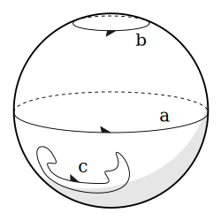
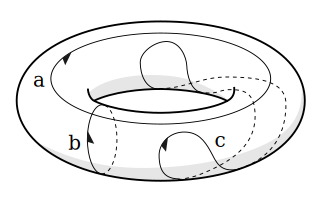
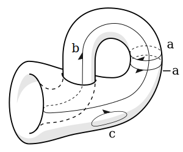
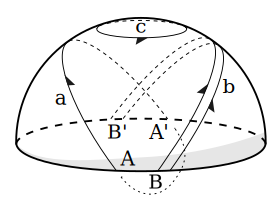

## 引子

我们可以将正方形的边界以四种不同的方式粘合起来：

而分别形成

球形：

环面：

克莱因瓶：

射影平面：

当我们讨论这样的粘合构造的时候，我们其实是在构造胞状复形。

维基百科的 [Cell complex](https://en.wikipedia.org/wiki/CW_complex) 文章，
用数学语言精确地描述了如何构造胞状复形。
但是，对于不熟悉拓扑学中诸多概念的同学而言，
维基百科的文章可能有些难懂。

在这篇文章中，我想介绍一下我对构造胞状复形的理解，希望我的介绍能更易懂。
同时，我还想尝试设计一个语言来形式化地构造胞状复形。

## 构造胞状复形的材料

构造胞状复形，在于将许多胞状结构粘连起来，复合而成复杂的拓扑形状。

所谓「胞状结构」，就是团状结构，也就是实心球一类的结构。
我们将用「球状结构」来指空心球一类的结构，
而「团状结构」来指实心球一类的结构。

提到「团状」的「团」，可以想像团子和元宵，这种实心的柔软的东西。

提到「胞状」的「胞」，可以想像细胞，或者晶体结构中的晶胞。

所谓「团状」和「球状」，之所以有个「状」字，
是因为我们取了三维空间中常见的形状作为代表，
用以指代各个维度中与其构造方式相似的结构。

| 维度 | 团状结构 | 球状结构       |
| ---- | -------- | -------------- |
| 零维 | 点       | 空             |
| 一维 | 线段     | 线段的两个端点 |
| 二维 | 圆盘     | 圆形           |
| 三维 | 实心球   | 球形           |

注意：

- 这个表格中，球状结构本身的维度，要比所对应的团状结构低一个维度。
  比如球形本身是二维的，实心球才是三维的。

- 这个表格中，所列的球状结构，都是所对应的团状结构的边界。
  比如球形，是实心球的边界。

## 粘连

> 构造胞状复形，在于将许多胞状结构粘连起来，复合而成复杂的拓扑形状。

如何将许多胞状结构粘连起来呢？

- 首先，粘连是从低维到高维，一个维度一个维度地进行的。
  低维的部分制作好了，就形成了低维的骨架，
  作为粘连高一个维度的胞状结构的基础。

- 其次，粘连是在边界上做的。
  显然胶水只能涂抹在胞状结构的边界上。

- 最后，两个胞状结构之间的粘连是间接的。
  如果两个胞状结构的某部分边界被粘连到了一起，
  不是因为我们直接粘连了两部分边界，
  而是因为我们将两部分边界分别粘连到了同一块骨架上。

具体如何操作呢？
毕竟这是数学的抽象构造呀，
不像包元宵、捏泥塑那样，可以真的用手去作。

我能想到两种方式，
一是用解析几何的方法（感谢笛卡尔），
二是用离散数学的方法（毕竟我们所关心的只是拓扑属性，而不是几何属性）。

### 解析几何的方法

先介绍解析几何的方法。

- 首先，我们可以给制作过程中所用到的每个胞状结构一个标签，
  用以区分结构相同的各个胞状结构。

- 其次，我们可以给每个胞状结构设计一个坐标系，
  利用这个坐标系，我们可以描述胞状结构中的任意一点，
  因此也能描述胞状结构的边界。
  其实针对每个维度的胞状结构，我们只需要设计一种坐标系，
  因为它们的结构都是相同的。

- 最后，我们可以用一个胞状结构的边界到已经制作好的骨架之间的连续映射，
  来描述一个胞状结构，具体是如何被粘合到骨架上的。
  这种映射称为粘合映射。

- 这样我们就完成了构造。
  此时我们可以通过标签来指出一个胞状结构，
  也可以通过胞状结构的坐标系来描述其中的任意一点，
  同时粘合映射又描述了具体的粘合方式。

解析几何的方法稍显复杂，
胞状结构的解析坐标系与作为解析函数的粘合映射，
甚至给出了几何结构，使得我们可以度量点之间距离等等。
但是，实际上我们只关心拓扑结构。

### 离散数学的方法

下面介绍离散数学的方法，
在保持拓扑结构不变的前提下，
我们可以用多边形取代圆形，用多面体取代球形，等等。
而连续映射可以被局部线性映射拼接而成。

我们重新列一下制作胞状复形过程中所用到的材料。

| 维度 | 团状结构                 | 球状结构           |
|------|--------------------------|--------------------|
| 零维 | 点                       | 空                 |
| 一维 | 线段                     | 线段的两个端点     |
| 二维 | 实心多边形（取代圆盘）   | 多边形（取代圆形） |
| 三维 | 实心多面体（取代实心球） | 多面体（取代球形） |

下面我们逐个维度讨论一下具体的离散构造。

- 零维：首先是空，我们还什么都没有。
  此时我们可以自由地引入零维团状结构，即点。

- 一维：已经引入的点，形成了零维骨架。
  此时我们可以引入一维团状结构，即线段。
  想要描述粘合方式，就是描述线段的两个端点，
  如何映射到零维骨架中的点上。

  注意，此时我们有了图论。
  并且既可以将其理解为无向图，也可以将其理解为有向图。
  如果我们只考虑粘合而成的一维骨架，就是无向图的图论；
  如果我们又考虑到了，用以作粘合的每个线段，
  其两个端点是可以被区分的，
  区分了起点和重点，线段就有了方向，
  就得到了有向图的图论。

- 二维：已经引入的点和线段，形成了一维骨架。
  此时我们可以引入二维团状结构，即实心多边形。
  实心多边形的边界是多边形。
  想要描述粘合方式，就是描述实心多边形的边界多边形，
  是如何映射到一维骨架中的线段上的。

未完待续⋯⋯
