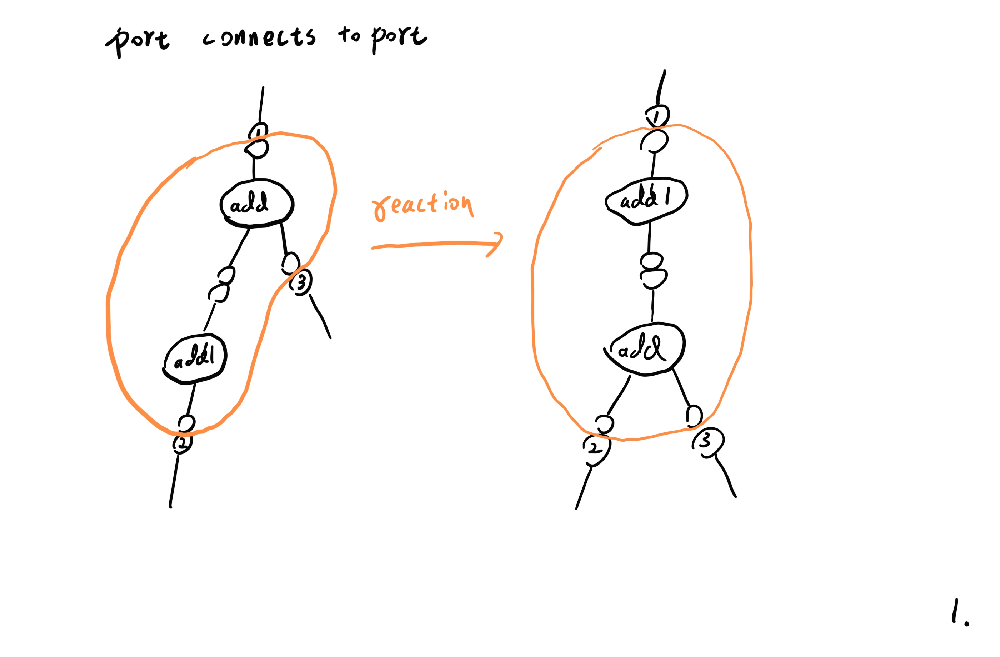
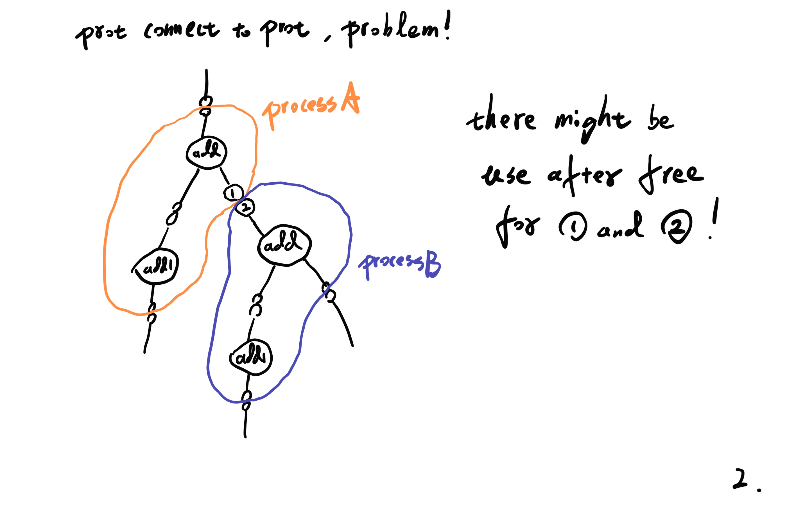
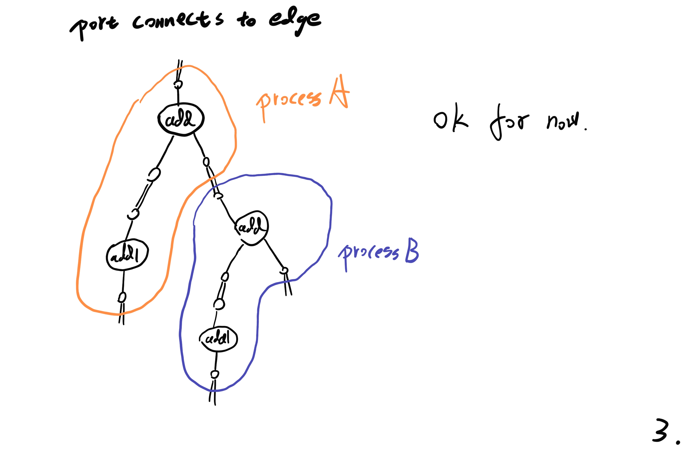
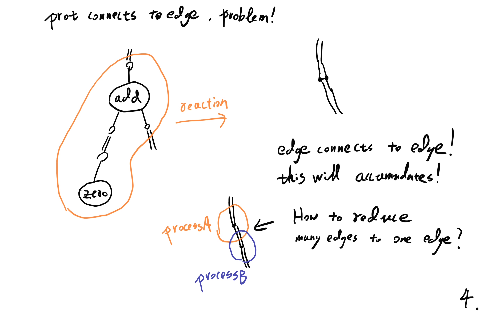
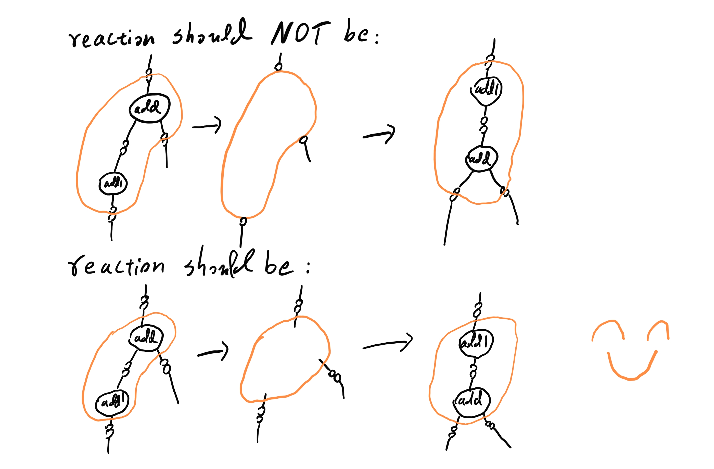

今天发现了对 interaction nets 的巨大认知错误。

我误以为 inet 用 "port connects to port" 实现的时候，
会有 "use after free" 的问题：

- 注意，展示 problem 的图，"port" 错拼成了 "prot"。

还误以为 "port connects to edge" 实现的时候，
会有 "accumulation of edges" 的问题：

其实根本就没有这些问题，主要是对 free port 的理解有错误：

只要换成这种理解方式：

- 就没有不同 thread 之间相互影响的问题（不需要所谓的 `HalfEdge`）。

- 节省在运行 rule 的过程中，也就是 disconnect + reconnect 的过程中，
  free 内存和 allocate 新内存的次数。
  因为可以重用 free port：
  - port-(node) -- claim a free port from the stack
  - (node)-port -- return a free port connected to (node)-port

这样实现就可以简洁很多，
可以回到 port 与 port 相连的模式。
